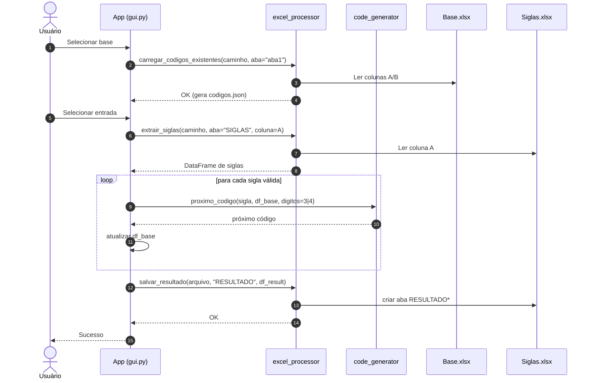
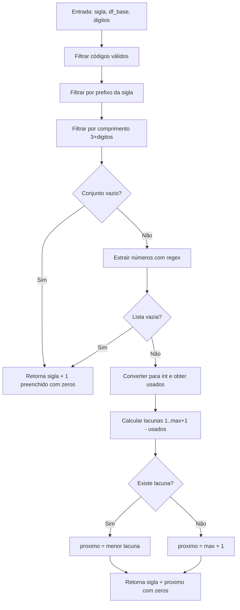

# GERADOR_DE_CODIGOS

Gerador de códigos sequenciais a partir de **siglas** (prefixos de 3 letras), com **interface moderna** (Tkinter + ttkbootstrap) e integração com **Excel** (openpyxl/pandas). O app lê uma base de códigos existente, calcula o **próximo código disponível** para cada sigla (preenchendo lacunas) e grava o resultado de volta em uma nova aba do arquivo de entrada.

> Exemplos de formato: `ABC0001` (4 dígitos) ou `ABC001` (3 dígitos).

---

## ✨ Novidades (2025-09)
- **Interface renovada**: cabeçalho “hero”, **cards** (Arquivos/Opções/Ações), **status bar**, **seleção de tema** (claro/escuro) e **atalhos de teclado**.
- **Ajuda aprimorada**: guia claro em janela própria, com **ícone do GitHub clicável** 
- **Desempenho**: geração **em lote** (O(n)) via `core/fast_code_generator.py`, mantendo a lógica de preencher lacunas por sigla.
- **Otimização de startup**: imports “preguiçosos” (lazy) das bibliotecas pesadas somente no **momento de processar**.
- **Compatibilidade de ícone**: carregamento do `assets/github_16.png` com **tamanho fixo 16×16** (usa Pillow se disponível; fallback sem Pillow).

---

## 🧱 Arquitetura (alto nível)
- `core/code_generator.py` — funções legadas (`codigo_valido`, `proximo_codigo`).
- `core/fast_code_generator.py` — **geração em lote** mantendo a mesma regra de lacunas, muito mais rápida.
- `core/excel_processor.py` — I/O com Excel (carregar base, extrair siglas, salvar resultado).
- `ui/gui.py` — interface do usuário (layout moderno, cards, temas, atalhos, status bar).
- `ui/help.py` — guia de ajuda e **ícone/link** do GitHub reutilizável.
- `ui/theme.py` — aplicação e pequenos ajustes de tema ttkbootstrap.
- `utils/helpers.py` — utilidades (ex.: `letra_para_coluna`).
- `assets/github_16.png` — ícone do GitHub usado na Ajuda (CTA).

> O app gera um arquivo intermediário `codigos.json` com a base carregada (usado durante o processamento).

---

## 📦 Requisitos
- **Python** 3.10+
- **pandas**
- **openpyxl**
- **ttkbootstrap**
- **(opcional)** `Pillow` — melhora a nitidez do ícone (não obrigatório)

> Linux pode exigir: `sudo apt-get install python3-tk`

### Instalação
```bash
# 1) Ambiente virtual (opcional)
python -m venv .venv
# Windows
.venv\Scripts\activate
# Linux/macOS
source .venv/bin/activate

# 2) Dependências
pip install -r requirements.txt
# (opcional) para melhor render do ícone
pip install pillow
```

---

## 🚀 Como usar (GUI)
1) **Selecionar base** → escolha o Excel com códigos existentes (aba padrão: `aba1`).
2) **Selecionar entrada** → escolha o Excel com as **siglas** (aba: `SIGLAS`, coluna: `A`).
3) **Opções** → marque **“Gerar códigos com 3 dígitos”** se quiser sufixo `001` (senão usa `0001`).
4) **Processar** → o resultado é gravado em nova aba `RESULTADO` (ou `RESULTADO1`, ...).
5) **Ajuda** → abre um guia claro com boas práticas + **ícone do GitHub** para documentação completa.

### Atalhos
- **Ctrl+O**: Selecionar base
- **Ctrl+I**: Selecionar entrada
- **Ctrl+P**: Processar
- **F1**: Ajuda (guia)

### Seleção de tema
- No topo da janela, escolha temas ttkbootstrap (ex.: `flatly`, `darkly`, `superhero`, ...).

---

## 🧮 Regras de geração de códigos
- Formato aceito: **3 letras** + **3 ou 4 dígitos** (ex.: `ABC001` / `ABC0001`).
- Considera apenas códigos **válidos** e com **mesma sigla e tamanho**.
- Seleciona o **menor número faltante** por sigla; se não houver, começa em `001`/`0001`.

Exemplos:
- Base: `ABC0001`, `ABC0003` → Próximo: `ABC0002`
- Base vazia para `XYZ` → Próximo: `XYZ0001` (ou `XYZ001` se 3 dígitos)

---

## ⚡ Desempenho
- **Geração em lote** (`core/fast_code_generator.py`) indexa a base por sigla uma única vez e aloca códigos em O(1) amortizado por sigla.

> Resultado: Processamento muito mais ágil com muitas siglas.

---

## 💻 Empacotamento (PyInstaller)
O app funciona com `--onefile` (arquivo único) 
### Recomendações para `--onefile`
- Use `--noupx` para evitar descompressão extra em runtime.
- Exclua módulos que não usa (reduz tamanho e tempo de extração): `--exclude-module`.
- Inclua os assets explicitamente (ícone do GitHub): `--add-data "assets;assets"` (Windows) ou `--add-data "assets:assets"` (Linux/macOS).

#### Exemplos de comandos
```bash
# Windows (PowerShell/CMD) — arquivo único
pyinstaller --onefile --noconsole --noupx ^
  --name GeradorCodigos ^
  --add-data "assets;assets" ^
  path\para\main.py

# Pasta (abre mais rápido, sem extração em tempo de execução)
pyinstaller --onedir --noconsole ^
  --name GeradorCodigos ^
  --add-data "assets;assets" ^
  path\para\main.py
```

> Dica: alguns antivírus verificam executáveis extraídos em `%TEMP%`. Se o startup estiver muito lento, adicionar **exceção** para a pasta de extração do PyInstaller pode ajudar (política de TI local).

---

## 🗺️ Diagramas (Mermaid)

### 1) Arquitetura de Módulos e Artefatos
```mermaid
graph TD
    U[Usuário] --> GUI[App gui.py]

    subgraph CORE [core/]
        CG[code_generator.py (codigo_valido, proximo_codigo)]
        EP[excel_processor.py (carregar_codigos_existentes, extrair_siglas, salvar_resultado)]
    end

    subgraph UTILS [utils/]
        H[helpers.py (letra_para_coluna)]
    end

    subgraph CONFIG [config/]
        T[texts.py (TEXTS)]
    end

    GUI --> EP
    GUI --> CG
    GUI --> H
    GUI --> T

    B[(Base.xlsx - aba: aba1, colunas: A/B)]
    S[(Siglas.xlsx - aba: SIGLAS, coluna: A)]
    J[(codigos.json)]
    R[(Aba RESULTADO*)]

    EP -- lê --> B
    EP -- gera --> J
    EP -- lê --> S
    EP -- escreve --> R
    CG -- usa --> J
```

### 2) Diagrama de Sequência (Fluxo pela Interface)


### 3) Fluxo do Algoritmo `proximo_codigo`


> Observação: os diagramas Mermaid renderizam diretamente no GitHub. Evite HTML dentro dos blocos Mermaid para não provocar erros de parsing.

---

## 🧪 Teste rápido (sem Excel)
```python
import pandas as pd
from core.fast_code_generator import gerar_codigos_em_lote

base = pd.DataFrame({"Codigo": ["ABC0001", "ABC0003", "DEF0001"]})
print(gerar_codigos_em_lote(["ABC", "XYZ", None], base, digitos=4))  # ['ABC0002', 'XYZ0001', None]
```

---

## 🔧 Solução de problemas
- **Tkinter não encontrado** (Linux): instale `python3-tk`.
- **Salvar no Excel falha**: feche o arquivo de siglas antes de processar.
- **Startup lento no `.exe` onefile**: mesmo com lazy imports, o PyInstaller precisa **extrair** arquivos a cada execução. Use `--noupx`, exclua módulos, e avalie exceção no antivírus para a pasta `%TEMP%`.

---

## 🤝 Contribuição
Abra *issues* e *pull requests* com descrição clara e exemplos de entrada/saída.

---
