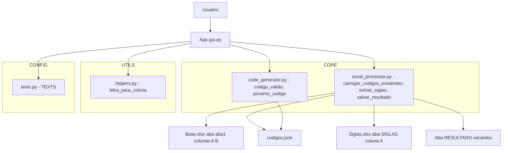
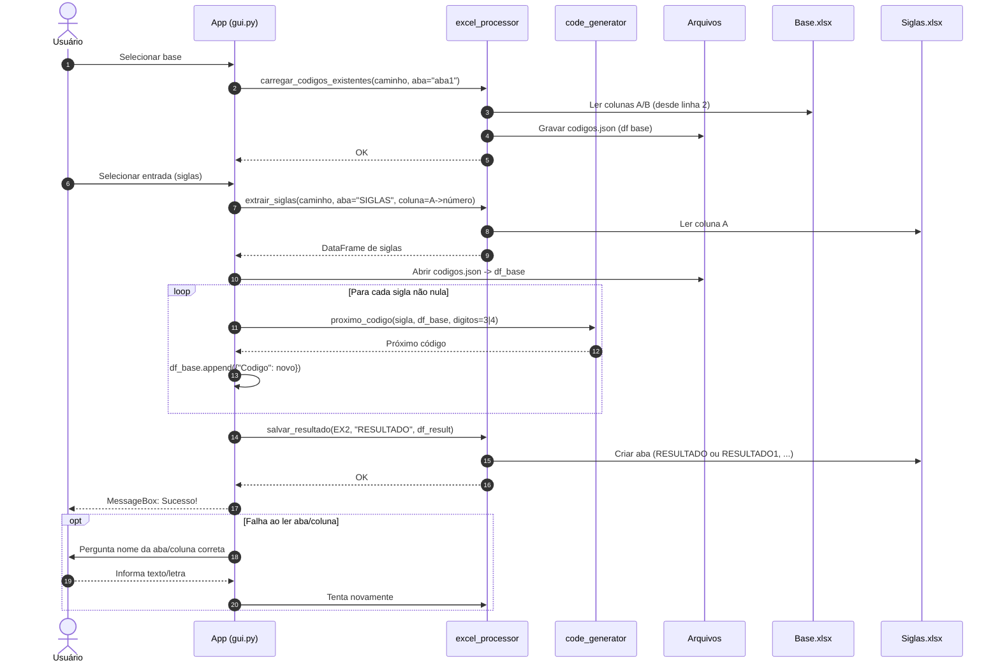
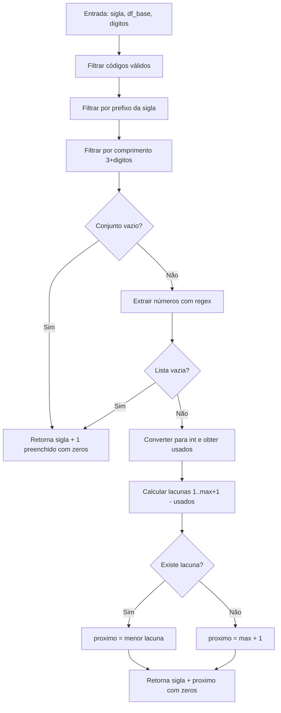

# GERADOR_DE_CODIGOS

Gerador de códigos sequenciais a partir de **siglas** (prefixos de 3 letras), com interface gráfica (Tkinter + ttkbootstrap) e integração com **Excel** (openpyxl/pandas). O app lê uma base de códigos existente, calcula o **próximo código disponível** para cada sigla (preenchendo lacunas) e grava o resultado de volta em uma nova aba do arquivo de entrada.

> Exemplo de formato: `ABC0001` ou `ABC001` (configurável para 4 ou 3 dígitos).

---

## ✨ Funcionalidades
- Importa uma **base de códigos** de um arquivo Excel (planilha de referência).
- Extrai **siglas** (prefixos) de outro arquivo Excel.
- Gera o **próximo número disponível**, preenchendo lacunas (ex.: se existe `ABC0001` e `ABC0003`, o próximo é `ABC0002`).
- Opção para sufixo numérico com **4 dígitos** (padrão) ou **3 dígitos**.
- Salva a saída em uma nova aba `RESULTADO`, preservando o arquivo original (sem sobrescrever abas existentes).
- Interface gráfica simples, com seleção de arquivos e feedback de sucesso/erro.

---

## 🧱 Arquitetura (alto nível)
- `core/code_generator.py` — valida formato e calcula o próximo código para uma sigla.
- `core/excel_processor.py` — lê planilhas Excel (base e siglas) e escreve a aba de resultado.
- `gui.py` — interface Tkinter/ttkbootstrap para orquestrar o fluxo: carregar base → carregar siglas → processar → salvar resultado.

> Observação: o app gera um arquivo intermediário `codigos.json` com a base já carregada (usado pela GUI durante o processamento).

---

## 📦 Requisitos
- **Python** 3.10+
- **pandas**
- **openpyxl**
- **ttkbootstrap** (usa Tkinter, já incluso no Python padrão em Windows/macOS; no Linux pode ser necessário instalar `python3-tk` via gerenciador de pacotes)

### Instalação
```bash
# 1) Crie e ative um ambiente virtual (opcional, mas recomendado)
python -m venv .venv
# Windows
.venv\\Scripts\\activate
# Linux/macOS
source .venv/bin/activate

# 2) Dependências
pip install -r requirements.txt
# (Linux) se necessário
# sudo apt-get install python3-tk
```

---

## 🚀 Como usar
1) **Base de códigos (Excel)**
   - Aba padrão: `aba1`
   - As **duas primeiras colunas** (A e B) podem conter códigos existentes. As linhas a partir da 2ª são lidas.
2) **Arquivo de siglas (Excel)**
   - Aba padrão: `SIGLAS`
   - Coluna padrão: `A` (uma sigla por linha — apenas o prefixo de 3 letras, por ex.: `ABC`).
3) **Executar a interface**
   - Rode o aplicativo (veja a seção *Execução* abaixo).
   - Clique em **Selecionar base**, escolha o Excel da base.
   - Clique em **Selecionar entrada**, escolha o Excel com as siglas.
   - (Opcional) Marque **“Gerar códigos com 3 dígitos”** para sufixo `001` em vez de `0001`.
   - Clique em **Processar**. Ao final, uma nova aba `RESULTADO` será criada no arquivo das siglas (ex.: `RESULTADO`, `RESULTADO1`, `RESULTADO2`, ...), contendo `Sigla` e `Proximo_Codigo`.

### Execução
Este repositório expõe a classe `App` em `gui.py`. Caso não exista um *entrypoint*, crie um `main.py` com:

```python
import tkinter as tk
from gui import App

if __name__ == "__main__":
    root = tk.Tk()
    App(root)
    root.mainloop()
```

Depois execute:
```bash
python main.py
```

---

## 🧮 Regras de geração de códigos
- Formato aceito: **3 letras** + **3 ou 4 dígitos** (ex.: `ABC001`/`ABC0001`).
- O algoritmo considera apenas códigos válidos e que **comecem** com a sigla informada.
- Entre os números já usados, ele encontra o **menor número faltante** (para preencher lacunas). Se não houver números existentes, retorna o **primeiro** (`001` ou `0001`).

Exemplo:
- Base: `ABC0001`, `ABC0003` → Próximo: `ABC0002`
- Base vazia para `XYZ` → Próximo: `XYZ0001` (ou `XYZ001` se 3 dígitos estiver ativo)

---

## 📁 Estrutura sugerida do projeto
```
.
├── core/
│   ├── code_generator.py
│   └── excel_processor.py
├── gui.py
├── utils/
│   └── helpers.py        # função letra_para_coluna("A") -> 1, etc.
├── config/
│   └── texts.py          # dicionário TEXTS com rótulos da interface
└── README.md
```

> **Dica**: Se estiver usando outro layout, ajuste os imports no `gui.py` para refletir sua estrutura.

### Arquivos auxiliares esperados
- `utils/helpers.py`: deve expor `letra_para_coluna(letra: str) -> int` (A→1, B→2, ...).
- `config/texts.py`: deve expor `TEXTS` com chaves usadas no GUI (ex.: `app_title`, `btn_select_base`, `btn_select_entrada`, `btn_processar`, `msg_final`).

---

## 📝 Tratamento de erros e mensagens
- Se a aba padrão **não existir**, a interface pergunta o nome correto.
- Para a coluna de siglas, se a **letra** padrão não existir, a interface pergunta a letra correta.
- Mensagens de **sucesso/erro** são apresentadas via `messagebox`.

---

## 🧪 Teste rápido (sem Excel)
Você pode simular a base com um `pandas.DataFrame` e chamar a função de geração:

```python
import pandas as pd
from core.code_generator import proximo_codigo

base = pd.DataFrame({"Codigo": ["ABC0001", "ABC0003", "DEF0001"]})
print(proximo_codigo("ABC", base, digitos=4))  # ABC0002
print(proximo_codigo("XYZ", base, digitos=3))  # XYZ001
```

---

## 🔧 Solução de problemas
- **Tkinter não encontrado** (Linux): instale `python3-tk` via seu gerenciador de pacotes.
- **openpyxl warnings**: assegure-se de salvar arquivos `.xlsx` (não `.xls`).
- **Permissões de escrita**: ao salvar a aba `RESULTADO`, o arquivo de siglas não pode estar aberto em outro programa.

---

## 🗺️ Roadmap (ideias)
- Suporte a múltiplas colunas de siglas.
- Validações extras (ex.: remover espaços/brancos, normalizar maiúsculas).
- Exportar CSV além de aba Excel.
- Log detalhado das operações.

---

## 🤝 Contribuição
Sinta-se à vontade para abrir *issues* e *pull requests*. Descreva claramente o problema/feature e inclua exemplos de entrada/saída.

---

## 🗺️ Diagramas (Mermaid)

### 1) Arquitetura de Módulos e Artefatos


### 2) Diagrama de Sequência (Fluxo pela Interface)


### 3) Fluxo do Algoritmo `proximo_codigo`

